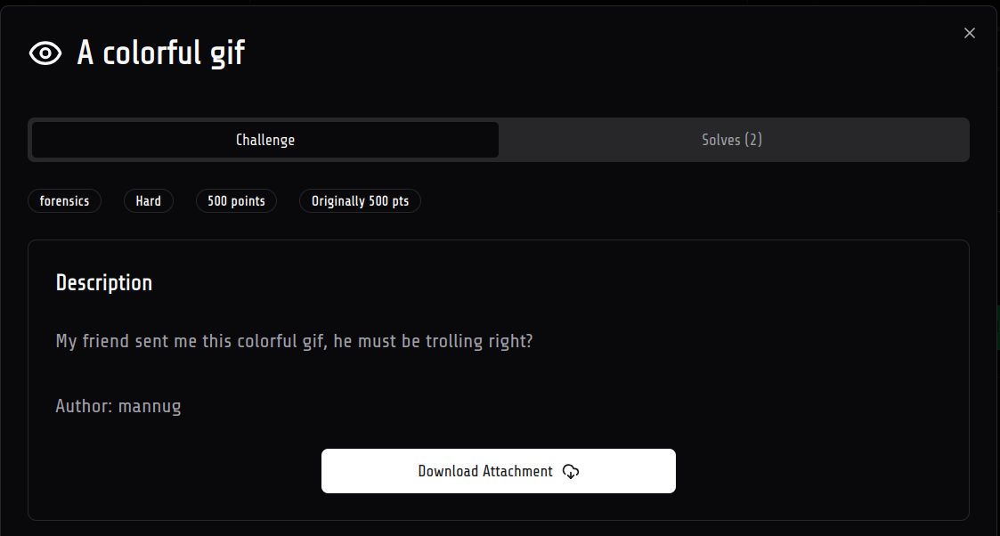
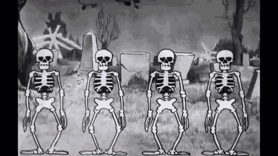
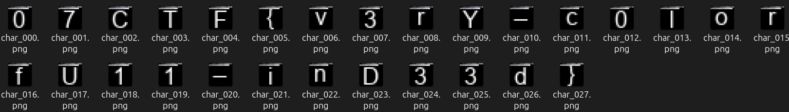

# A colorful gif 

Description - ```My friend sent me this colorful gif, he must be trolling right?```

Handout


## Solution
1. At first glance, it looks like a normal gif , but i saw the contrast between the name of the challenge and the gif was black and white , so i thought maybe the flag is hidden in the color channels of the gif

2. i researched about gif format and found different things , first i extracted the frames to see what can be wrong with them . there were 140 total frames , i found nothing wrong in them

3. The challenge was related to colors so i moved back to the colours and i knew that colors in GIF are stored in a palette in form of a color table , there are global color table and local color table . let us understand this in detail

### GIF data (Theory)

```
+--------------------------+
|        GIF Header        |
+--------------------------+
| Logical Screen Descriptor|
+--------------------------+
|    Global Color Table    |
+--------------------------+

+--------------------------+
|   Application Extension  |
+--------------------------+                  +-----------+
                                              |  GIF Data |
                                              +-----------+
+--------------------------+
| Graphic Control Extension|
+--------------------------+                     
|    Image Description     |
+--------------------------+
|    Image Description     |
+--------------------------+
|       Image Data         |
+--------------------------+(per frame)

+--------------------------+
|         Trailer          |
+--------------------------+
```
1. this was the main structure of the gif file , there are mainly two version of GIF87a and GIF89a , the difference is that GIF89a supports transparency and animation
2. **Logical Screen Descriptor** - it contains the width and height of the gif , and some flags to indicate if there is a global color table or not
3. **Global Color Table** - it contains the colors used in the gif , each color is represented by 3 bytes (RGB) 
4. **Application Extension** - it contains some metadata about the gif like the loop count , block size etc
5. **Image Descriptor** - this is the per frame data , it contains the position of the frame in the logical screen , and some flags to indicate if there is a local color table or not
6. **Local Color Table** - it contains the colors used in the frame , each color is represented by 3 bytes (RGB)
7. **Graphics Control Extension** - It tells each frame how long to stay on screen.
8. **Image Data** - This containts the actual picture data for each frame.
9. **Trailer** - this contains a single byte to indicate the end of the gif file containing hexadecimal 0x3B which is ';' in ascii

### Moving forward with the solution
1. the next step was to check if there is a global color table or not , and if there is a local color table or not
2. i used a script to parse the gif file and extract the global color table and local color table if they exist

```python
import struct

def read_global_color_table(file_path):
    with open(file_path, 'rb') as f:
        # Skip GIF Header (6 bytes: GIF87a or GIF89a)
        f.read(6)

        # Read Logical Screen Descriptor
        screen_width, screen_height = struct.unpack("<HH", f.read(4))
        packed_fields = struct.unpack("<B", f.read(1))[0]
        bg_color_index = struct.unpack("<B", f.read(1))[0]
        pixel_aspect_ratio = struct.unpack("<B", f.read(1))[0]

        # Check if Global Color Table exists (bit 7 of packed_fields)
        gct_flag = (packed_fields & 0b10000000) >> 7

        if gct_flag:
            # Determine the size of the Global Color Table
            gct_size_bits = packed_fields & 0b00000111
            gct_size = 2 ** (gct_size_bits + 1)

            print(f"Global Color Table Size: {gct_size} colors")

            # Read Global Color Table
            gct_data = f.read(3 * gct_size)  # Each color is 3 bytes (RGB)

            # Create a list of RGB triplets
            gct_colors = [(gct_data[i], gct_data[i + 1], gct_data[i + 2]) for i in range(0, len(gct_data), 3)]

            # Write Global Color Table to gct.txt
            with open('gct.txt', 'w') as out:
                for i, color in enumerate(gct_colors):
                    out.write(f"{i}: {color[0]} {color[1]} {color[2]}\n")
            return gct_colors

        else:
            print("No Global Color Table present.")
            return []

def rgb_to_hex(r, g, b):
    return "#{:02x}{:02x}{:02x}".format(r, g, b)

colors = read_global_color_table('colorful.gif')
```
**Explanation of GCT script**

- **read_global_color_table(file_path)** - this function reads the gif file and extracts the global color table if it exists and writes it to gct.txt

- now extracting the local color table
```python
def format_palette_bytes(palette_bytes):
    if not palette_bytes:
        return "N/A"
    colors = [tuple(palette_bytes[i:i+3]) for i in range(0, len(palette_bytes), 3)]
    return ", ".join(map(str, colors))

def skip_data_sub_blocks(file_handle):
    while True:
        block_size = file_handle.read(1)
        if not block_size or block_size == b'\x00':
            break
        file_handle.read(int.from_bytes(block_size, 'little'))

def find_all_lcts(file_path, output_path):
    with open(file_path, 'rb') as f, open(output_path, 'w') as log:
        log.write(f"Local Color Table Analysis for: {file_path}\n")
        log.write("=" * 50 + "\n\n")

        # --- Header and Logical Screen Descriptor ---
        f.read(10) # Skip header and screen dimensions
        packed_fields = int.from_bytes(f.read(1), 'little')
        gct_flag = (packed_fields & 0x80) >> 7
        gct_size_val = packed_fields & 0x07
        f.read(2) # Skip background color index and pixel aspect ratio

        # --- Skip Global Color Table (GCT) ---
        if gct_flag:
            gct_length = 3 * (2 ** (gct_size_val + 1))
            f.read(gct_length)

        # --- Main Loop to Find All Frames ---
        frame_counter = 0
        while True:
            block_type = f.read(1)
            if not block_type:
                log.write("End of file reached.\n")
                break

            # Extension Block
            if block_type == b'\x21':
                f.read(1) 
                skip_data_sub_blocks(f)

            # new frame
            elif block_type == b'\x2C':
                log.write(f"--- Frame {frame_counter} ---\n")
                f.read(8) 
                
                packed_field = int.from_bytes(f.read(1), 'little')
                lct_flag = (packed_field & 0x80) >> 7
                lct_size_val = packed_field & 0x07

                if lct_flag:
                    log.write("Status: Local Color Table (LCT) FOUND\n")
                    lct_length = 3 * (2 ** (lct_size_val + 1))
                    lct_data = f.read(lct_length)
                    log.write(f"Size: {lct_length} bytes ({lct_length // 3} colors)\n")
                    log.write(f"Values: {format_palette_bytes(lct_data)}\n\n")
                else:
                    log.write("Status: No LCT found (uses GCT)\n\n")
                
                #Skip the actual image data to get to the next block
                f.read(1) # LZW Minimum Code Size
                skip_data_sub_blocks(f)
                frame_counter += 1

            # Trailer
            elif block_type == b'\x3B':
                log.write("GIF Trailer found. End of image data.\n")
                break
            
            else:
                log.write(f"Unknown block type {block_type.hex()} found. Stopping parse.\n")
                break
    
    print(f"[SUCCESS] palette analysis complete. See '{output_path}'.")


if __name__ == "__main__":
    gif_filename = "colorful.gif"
    log_filename = "LCT.txt"
    find_all_lcts(gif_filename, log_filename)
```
**Explanation of LCT code**
- **format_palette_bytes(palette_bytes)** - this function takes a flat list of palette bytes and formats them into a readable list of (R, G, B) tuples
- **skip_data_sub_blocks(file_handle)** - this function skips over GIF data sub-blocks
- **find_all_lcts(file_path, output_path)** - this function skips GIF header and Global Color Table if present , then iterates through the blocks to find Image Descriptor blocks (frames) and checks for Local Color Tables (LCTs) , then the trailer block and then writes the results to file

3. as we can see that there is a local color table for each frame and it is unqiue and a gct for the whole gif , i tried to visualize the colors( as mentioned in the challenge name)

4. using per frame local color table i created a image of 16x16 pixels (256 colors) and filled each pixel with the color from the local color table using this script

```python
import re
import os
from PIL import Image

def parse_log_file(log_path):
    """
    Parses the detailed log file to extract the LCT for each frame.
    Returns a list of palettes.
    """
    all_palettes = []
    try:
        with open(log_path, 'r') as f:
            content = f.read()
    except FileNotFoundError:
        print(f"[ERROR] The log file '{log_path}' was not found.")
        print("[INFO] Please make sure it's in the same directory as this script.")
        return None
    
    # Use regular expressions to find all blocks of LCT data
    lct_blocks = re.findall(r"Status: Local Color Table \(LCT\) FOUND.*?Values: (.*?)\n\n", content, re.S)
    print(f"[INFO] Found {len(lct_blocks)} LCTs in the log file.")

    for values_str in lct_blocks:
        try:
            # Safely evaluate the string "(r, g, b), ..." into a list of tuples
            palette = list(eval(values_str))
            all_palettes.append(palette)
        except Exception as e:
            print(f"[ERROR] Could not parse palette data: {values_str[:50]}... Error: {e}")
            
    return all_palettes

def visualize_lcts(palettes):
    output_dir = "flag_characters1"
    if not os.path.exists(output_dir):
        os.makedirs(output_dir)
        print(f"[INFO] Created directory: {output_dir}")

    BLOCK_SIZE = 20  # Size of each color block in pixels
    GRID_SIZE = 16   # The grid is 16x16

    char_count = 0
    for idx, lct in enumerate(palettes):
        # A 16x16 grid requires exactly 256 colors. Filter for these palettes.
        if len(lct) != 256:
            continue

        # Create a new image for this character
        char_image = Image.new("RGB", (BLOCK_SIZE * GRID_SIZE, BLOCK_SIZE * GRID_SIZE))

        # Fill the image with 16x16 blocks of color from the LCT
        for color_idx, color in enumerate(lct):
            row = color_idx // GRID_SIZE
            col = color_idx % GRID_SIZE
            
            # Top-left corner of the block
            start_x = col * BLOCK_SIZE
            start_y = row * BLOCK_SIZE
            
            # Draw the block
            for x in range(BLOCK_SIZE):
                for y in range(BLOCK_SIZE):
                    char_image.putpixel((start_x + x, start_y + y), color)

        # Save the resulting character image
        output_filename = os.path.join(output_dir, f"char_{char_count:03d}.png")
        char_image.save(output_filename)
        char_count += 1

    if char_count > 0:
        print(f"\n[SUCCESS] Created {char_count} character images in the '{output_dir}' folder.")
        print("[INFO] Open the folder and view the images in order by filename to reveal the flag.")
    else:
        print("\n[FAIL] No 256-color LCTs were found to visualize.")

if __name__ == "__main__":
    log_filename = "LCT.txt"
    all_lcts = parse_log_file(log_filename)
    
    if all_lcts:
        visualize_lcts(all_lcts)
```
**Explanation of visualization code**
- **parse_log_file(log_path)** - this function reads the log file using regex "Values: (...)" , then converts each block of RGB to a list of tuples and retunrs it
- **visualize_lcts(palettes)** - this function first makes a directory to store images , then loops through all the palettes with 256 colors , then for each palette it creates a blank image then fills it 16x16 grid with each color from the palette and saves it as char_000.png , char_001.png etc\
- **main** - bruh this calls the two function 😭

5. after running the script we got the flag 




(i spent around 4-5 hours on this , it was really fun and i used my full brain 🧠 )

### Flag
```
07CTF{v3rY_c0lorfU11_inD33d}
```
 