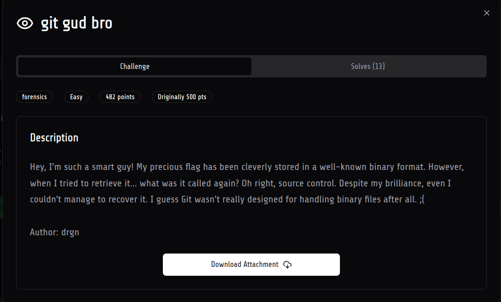
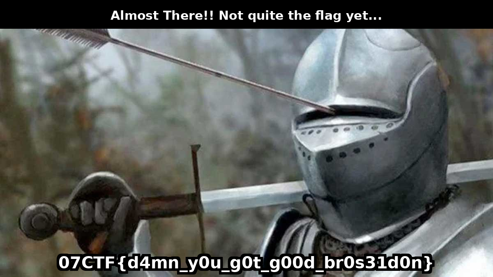

# git gud bro

- description -
```Hey, I'm such a smart guy! My precious flag has been cleverly stored in a well-known binary format. However, when I tried to retrieve it... what was it called again? Oh right, source control. Despite my brilliance, even I couldn't manage to recover it. I guess Git wasn't really designed for handling binary files after all. ;(```
- author - drgn(ily bro)


## Solution

-  the challenge handout was given to us with a .git folder 
- it had so many commits i got scared , oh naa , now i have view them one by one but not this time hehe
- i saw one thing ( after wasting 1 hour), that every commit was different and apparently they are of similar size 
- so i took all the git commits and combined the contents of flag (in reverse order , trust me i didnt do it in forward)
- i made this 


```bash
for commit in $(git log --reverse --pretty=format:"%H" -- flag); do     git show $commit:flag >> allflag; done
```


- now we have a file called allflag , analyzing it


```bash
handout on  HEAD (e842b25) [?] 
❯ file allflag 
allflag: PNG image data, 1200 x 675, 8-bit/color RGB, non-interlaced

handout on  HEAD (e842b25) [?] 
❯ xxd allflag | head
00000000: 8950 4e47 0d0a 1a0a 0000 000d 4948 4452  .PNG........IHDR
00000010: 0000 04b0 0000 02a3 0802 0000 0082 d161  ...............a
00000020: 9700 0100 0049 4441 5478 9cec fd7b b42d  .....IDATx...{.-
00000030: 4b55 1f8e cf39 abba d76b affd 38af 7b2f  KU...9...k..8.{/
00000040: 978b 0246 6230 280c 108c 215f 5e6a 0045  ...Fb0(...!_^j.E
00000050: 0606 3511 3484 2090 a818 1447 1c43 34dc  ..5.4. ....G.C4.
00000060: 0131 8828 0951 0109 0645 45f9 45c1 274a  .1.(.Q...EE.E.'J
00000070: 4041 0522 8882 a868 0ca0 c8bd dc7b 1efb  @A."...h.....{..
00000080: b99e dd35 e7ef 8fd9 55ab ba7b ad75 f63e  ...5....U..{.u.>
00000090: 67df 8758 9f71 c63a 6bf7 eaae aec7 ac59  g..X.q.:k......Y

handout on  HEAD (e842b25) [?] 
❯ xxd allflag | tail
00080a00: 3484 527a 699b 66ca b91e 173a e4a0 c69c  4.Rzi.f....:....
00080a10: 9bf3 3c2f 57c9 9554 4990 0080 ea77 2c45  ..</W..TI....w,E
00080a20: b466 35d3 4fd1 60b1 c991 e338 9eeb e773  .f5.O.`....8...s
00080a30: 8542 a150 28b6 3366 8cb5 57d6 c64b b59f  .B.P(.3f..W..K..
00080a40: 1682 5991 8435 df18 ff54 fdb6 1523 8993  ..Y..5...T...#..
00080a50: c53e 5fa2 9325 feae 0fd1 8224 b650 4e46  .>_..%.....$.PNF
00080a60: 1f84 148d 6722 6f07 ecb8 52ae 542a 954a  ....g"o...R.T*.J
00080a70: 18b0 3d51 f3e0 3abe effa aeeb 798e e779  ..=Q..:.....y..y
00080a80: 39cf f3d1 614d c980 5630 582a f5f6 f66e  9...aM..V0X*...n
00080a90: e8e9 e9e9 eddd dcdf                      ........
```

- we got a png 


- that is not normal , a png ends with a **IEND** chunk

**EXAMPLE**


```bash
xxd image.png | tail
0001e060: 8e97 de9b 4530 6574 9ca0 8a40 4f93 beeb  ....E0et...@O...
0001e070: a361 7ac3 41c7 f5df a490 945f 719f 49e7  .az.A......_q.I.
0001e080: 97c9 691b 2f9d 4795 da32 dddb 365e 69ca  ..i./.G..2..6^i.
0001e090: d056 5e92 48ab ad2a 71d7 b465 2baf 5da8  .V^.H..*q..e+.].
0001e0a0: b7aa e295 4653 6597 a1a9 2de6 eda4 aea7  ....FSe...-.....
0001e0b0: a4f6 5a92 97cd f5a9 e978 565e d29c 929e  ..Z......xV^....
0001e0c0: dde6 b63a a97e b585 9734 8738 4efc be79  ...:.~...4.8N..y
0001e0d0: 7949 f28c ab0b 92ca 2aee 19ea 28c3 ff0f  yI......*...(...
0001e0e0: a643 1cc8 56f2 9539 0000 0000 4945 4e44  .C..V..9....IEND
0001e0f0: ae42 6082                                .B`.
```


- in a PNG , IDAT chunk contains the actual image data and the IEND chunks mark the end of the file
-  checking for IEND

```bash
xxd allflag | grep IEND
000403c0: 7a00 0000 0049 454e 44ae 4260 8274 90ae  z....IEND.B`.t..
00080780: 053b 0700 0000 0049 454e 44ae 4260 8252  .;.....IEND.B`.R
```


- we can see that it has two IEND chunks , i dont know why but now we have two possiblities that the data after iend is some other file type but it doesnt seem so as we cannot see any other header , the second possiblities is that iend chunk is just misplaced , we can just try , trying the second possiblity first , we can do it by hand and we can also write a simple script for this

```python
import sys

if len(sys.argv) != 3:
    sys.exit(1)

input_file = sys.argv[1]
output_file = sys.argv[2]

with open(input_file, "rb") as f:
    data = f.read()
iend_index = data.find(b'\x00\x00\x00\x00IEND')
if iend_index == -1:
    raise ValueError("IEND chunk not found")

iend_chunk = data[iend_index:iend_index+12]

before_iend = data[:iend_index]
after_iend = data[iend_index+12:]
new_data = before_iend + after_iend + iend_chunk

with open(output_file, "wb") as f:
    f.write(new_data)

print(f"Saved : {output_file}")
```


- this script first scans for system arguments for input and output files and then find the iend chunk(12bytes) then moves the iend chunk to the last 

- running the python script ```python sol.py allflag.png sol.png
Saved : sol.png```

- we got the flag and the full image 



## Flag

```
07CTF{d4mn_y0u_g0t_g00d_br0s31d9n}
```